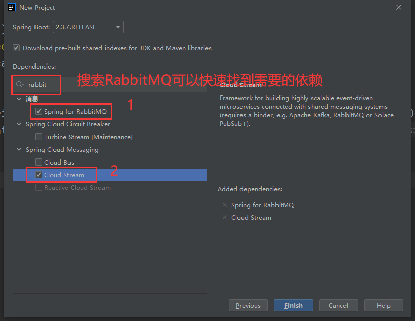
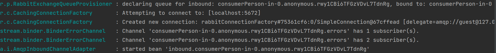
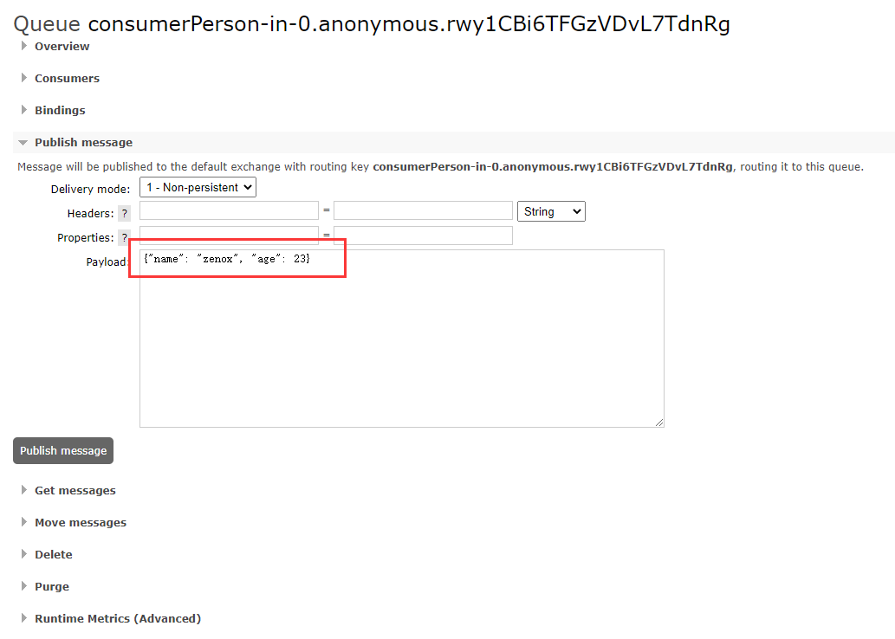
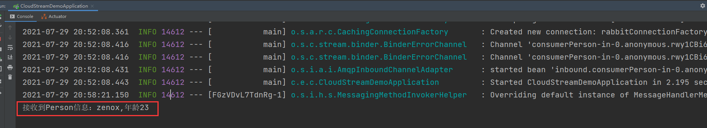

# 前言

在微服务架构流行的今天，消息队列的应用显得尤为重要，然而对于一个Java或者说一个Spring项目来说，不同的消息队列需要导入不同的driver依赖，这种情况下，就产生了一个痛点，即项目极有可能深度与某个特定的消息队列绑定，而通过本文所述的这项技术Spring Cloud Stream，可以将消息队列driver的实现与应用代码分离，即开发者不需要再写带有“mq特色”的代码了。

过去，我们可以通过Spring Integration来集成各种企业级别应用的外部系统，比如数据库、消息队列，随着Spring Boot的不断壮大和流行，官方将Spring Integration与Spring Boot整合到了一块，形成了一个新的项目--Spring Cloud Stream。

# 简单示例

以下的案例根据Spring官方文档编写。

## 创建SpringBoot项目

由于Spring Cloud Stream项目是基于Spring Boot的，那么自然可以使用Spring Initializr进行快速构建，这个案例需要以下的依赖，这里用到的消息队列实现是RabbitMQ，当然如果你用的是Kafka、RocketMQ等，SpringCloudStream也支持，其他消息队列具体如何集成、配置都可以从[官方文档](https://docs.spring.io/spring-cloud-stream/docs/3.1.3/reference/html/index.html)上找到。

* Spring-RabbitMQ集成
* Spring Cloud Stream



## 定义消息实体

在这个项目中，我们一定是希望将Java对象作为消息在微服务之间传递，假设要传递的对象就是Person类，包含他的名字、年龄等信息。

```java
public class Person {
    private String name;
    private Integer age;

    public String getName() {
        return name;
    }

    public void setName(String name) {
        this.name = name;
    }

    public Integer getAge() {
        return age;
    }

    public void setAge(Integer age) {
        this.age = age;
    }
}
```

## 定义消费者

由于相对比较复杂，这里暂时先不讨论生产者是如何定义的，而是先说说怎么定义消费者。

创建一个Configuration类（或者用Component、Service等注解都是可以的），然后其中定义一个Consumer的Bean，其职责就是用来接收并消费Person消息，如下所示。

```java
@Configuration
public class MessageConfig {

    @Bean
    public Consumer<Person> consumerPerson() {
        return person -> {
            System.out.println("接收到Person信息：" + person.getName() + "," + "年龄" + person.getAge());
        };
    }
}
```

可以看到这边使用了java.util.function.Consumer，使用过java 8特性函数式编程的朋友应该不陌生，这里不展开介绍java 8的函数式编程和lamda表达式，如果有需要的话，这里推介一个我比较喜欢的知乎博主的文章 [在Java代码中写Lambda表达式是种怎样的体验？](https://www.zhihu.com/question/37872003/answer/1009015660)

这里需要说一下，SpringCloudStream目前的最新版本3.1.3支持两种编程模式，第一种就是我上面的这种，即函数式编程，也是官方主推的使用方式；而另一种基于注解的使用方式，虽然3.1.3版本也支持，但按照官方说法，在不久的将来也许就要废弃了，所以本文后续使用的都是Spring官方主推的函数式编程。

## 安装一个用于测试的消息队列

定义好消费者代码后，实际上这个应用程序就已经具备了接收Person对象的能力，但还有两个问题，从**哪里**消费？**如何**消费？

先回答第一个问题，由于我们导入的是RabbitMQ与Spring的集成依赖，如果你不进行任何配置，在SpringBoot程序启动时自动尝试去连接localhost的5672端口，即RabbitMQ的默认端口，连接上后，框架自己会使用默认的配置创建一个exchange和一个对应的queue。

第二个问题，如何消费，正常情况下，我们一般会有一个对应的生产者程序，但这个例子里，我们只是演示如何使用Consumer端，那么可以直接使用RabbitMQ的管理端来发送测试消息，消费者会自动从消息队列中取出消息（一般来说就是json字符串），并自动转换为java对象。

了解消费者的工作模式后，就来安装一个RabbitMQ吧，我这里使用的是Docker镜像，可以参考下面的Docker指令，创建的RabbitMQ容器默认向外暴露5672和15672两个端口，即可以直接通过浏览器访问RabbitMQ管理端。

```shell
#拉取镜像rabbitmq:management，自带管理界面
docker pull rabbitmq:management

#运行镜像，这里简单配置了端口映射，账户名密码使用默认的guest guest
docker run --name rabbitmq-test -p 15672:15672 -p 5672:5672 rabbitmq:management
```

运行完成后，可以访问localhost:15672来查看是否安装成功。

当然如果你改一下Spring连接RabbitMQ的配置，通过配置文件application.properties或者application.yml修改即可。

```yaml
spring:
  rabbitmq:
    host: localhost
    port: 5672
    username: guest
    password: guest
```

## 发送Person消息进行测试

将程序运行起来，可以看到控制台输出了几句话，一般是这样的。



如果有上面这几句输出，一般说明程序成功连接上rabbitMQ并且根据consumer的定义自行创建了exchange和queue。

前往rabbitMQ管理端，找到对应的queue，在payload内填入json数据，包括Person的两个字段，点击publish message。



查看应用程序的控制台，可以发现消费者已经将刚才发送的消息打印了出来。



当然这仅仅是一个简单的消费者使用案例，如何定义生产者？以及如何控制SpringCloudStream操作RabbitMQ等，这都需要更多的配置，在本文后续会讲到。
